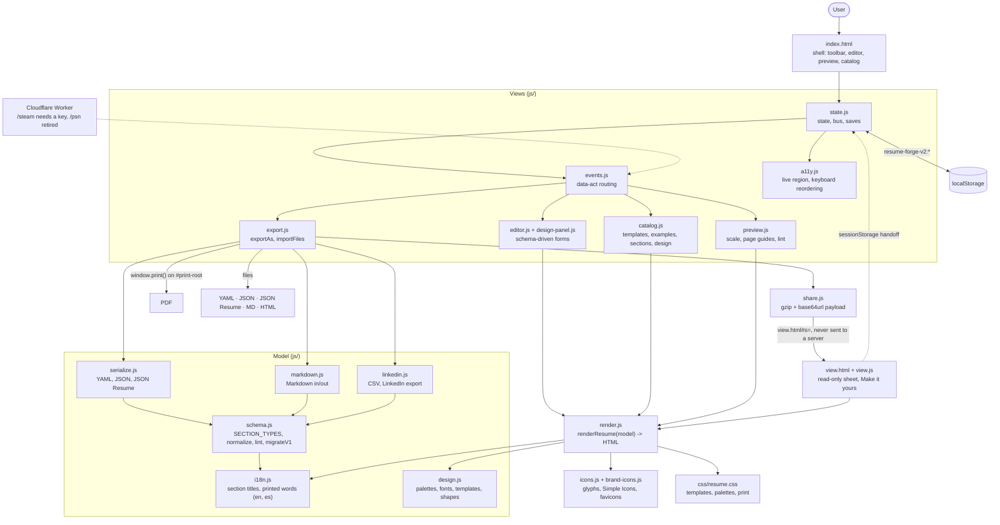

<div align="center">

# Resume Forge

CV builder: YAML in, PDF out

[![Live][badge-site]][url-site]
[![HTML5][badge-html]][url-html]
[![CSS3][badge-css]][url-css]
[![JavaScript][badge-js]][url-js]
[![Cloudflare][badge-cloudflare]][url-cloudflare]
[![Claude Code][badge-claude]][url-claude]
[![License][badge-license]](LICENSE)

[badge-site]:       https://img.shields.io/badge/live_site-8b5cf6?style=for-the-badge&logo=googlechrome&logoColor=white
[badge-html]:       https://img.shields.io/badge/HTML5-E34F26?style=for-the-badge&logo=html5&logoColor=white
[badge-css]:        https://img.shields.io/badge/CSS3-1572B6?style=for-the-badge&logo=css3&logoColor=white
[badge-js]:         https://img.shields.io/badge/JavaScript-F7DF1E?style=for-the-badge&logo=javascript&logoColor=black
[badge-cloudflare]: https://img.shields.io/badge/Cloudflare_Workers-F38020?style=for-the-badge&logo=cloudflare&logoColor=white
[badge-claude]:     https://img.shields.io/badge/Claude_Code-CC785C?style=for-the-badge&logo=anthropic&logoColor=white
[badge-license]:    https://img.shields.io/badge/license-MIT-404040?style=for-the-badge

[url-site]:       https://resume.neorgon.com/
[url-html]:       #
[url-css]:        #
[url-js]:         #
[url-cloudflare]: https://workers.cloudflare.com/
[url-claude]:     https://claude.ai/code

</div>

---

## Overview

Resume Forge treats a CV as **data**: one YAML document (or JSON, JSON Resume, Markdown, or
your LinkedIn export) rendered through templates you can switch at any time. Six layouts,
thirteen palettes, ten font pairings, banner and photo shapes, icon tiles for socials and
hobbies, and a vector PDF with selectable text and working links. English or Spanish. Everything
runs in the browser; saves live in the browser's storage, and a share link carries the whole
resume inside the address rather than uploading it anywhere.

**Live:** resume.neorgon.com

---

## Features

- **Templates**: banner (band with a pattern or photo, circle portrait over the edge, pill headings, icon tiles), sidebar, split, classic (single column, parser-friendly), stripe, cards. Switching keeps every word.
- **Sections as data**: experience, education, skills (tags, bars, dots, hearts, list, grid), languages, certifications, projects, awards, volunteering, publications, icon rows (socials, trophies, hobbies, tools), lists with a picture, tags, contact, references, gaming stats, page breaks. Drag between the main and side column groups, or focus a grip and press Arrow Up or Arrow Down; hide, delete. Every move is announced for a screen reader.
- **Page breaks**: drop a `pagebreak` section in the main column and the next section starts a new printed page. It prints nothing itself and shows a dashed marker while you edit.
- **Two languages**: set `meta.lang` to `es` and the section titles a new section is born with, and the words the sheet prints itself, are Spanish (an end date of `Present` prints as `Actualidad`). The file keeps English keys and the editor stays English, so nothing about your document changes shape. A title you typed is never overwritten.
- **Socials once**: type your links in Basics; an icon row with `source: basics` mirrors them as tiles in the side column (one click: "Show as tiles in the side column"), and `links: none` hides the copy beside the name.
- **Icons three ways**: 101 brand marks from Simple Icons vendored and recoloured by the palette, 56 drawn glyphs, the link's favicon, or an uploaded file (SVG or PNG, e.g. from freeicons.io) kept as a data URI.
- **Design**: palette, colour overrides, font pairing or any two Google Fonts, density, paper size, heading style, entry style (plain, timeline, cards), bullet glyph, photo shape and ring, banner shape, height, pattern and background image, column side and width.
- **Photo framing**: sliders in Design > Photo move the focal point left to right and top to bottom and zoom from 100% to 300%, so a portrait crops around the face instead of around the middle of the file.
- **Catalog**: templates rendered with your own data, six complete example resumes, every section type with a live sample, the design controls.
- **Formats**: import and export YAML (canonical, see `template.yaml`), JSON, JSON Resume, Markdown (readable, llms.txt style, round-trips), standalone HTML; import LinkedIn's data-export ZIP or CSVs; export PDF through the print dialog.
- **Share links**: one link that carries the whole resume. The reader opens a page that shows the sheet, can print it, and can copy it into their own builder. **Nothing is uploaded.** The resume rides in the URL fragment, which browsers never send to a server, and the viewer page turns analytics off so nothing reports the address either. Photos are left out unless you ask for them, because they are almost all of a link's length, and the dialog shows the measured length against the point where Safari stops opening links.
- **Gaming stats**: PSN and Steam blocks with every number typed in by hand. Fetching PSN is retired: the site it read now blocks automated requests. Fetching Steam goes through the official Steam Web API and only works when the site owner has set an API key, which is not set today.
- **Local saves**: named resumes in this browser, working copy autosaved, v1 data migrated.
- **Zero build**: plain ES modules, no compile step. `npm install` only for the node tests.

---

## Formats

| Format | In | Out | Notes |
|---|---|---|---|
| YAML | yes | yes | The canonical file. Root key `resume:`; every key is annotated in [`template.yaml`](template.yaml). |
| JSON | yes | yes | The same tree. |
| JSON Resume | yes | yes | jsonresume.org schema. Dates convert to `YYYY-MM`; a team rides as `Company (Team)` in `work[].name`. A JSON Resume pasted into the JSON importer is recognised by shape. |
| Markdown | yes | yes | `# Name`, `**Title**`, a contact line, `## Section <!-- type zone -->`, `### Entry` with a `Company (Team) · Location · Sep 2025 - Present · https://url` line and `- bullets`. Markers are optional: a hand-written file is classified by heading words. |
| LinkedIn export | yes | no | Settings > Data privacy > Get a copy of your data. Drop the ZIP, or pick the CSVs. Profile, Positions, Education, Skills, Languages, Certifications, Projects, Honors, Email Addresses, PhoneNumbers, Volunteering, Publications, Courses, Organizations are mapped; headers match by name with synonyms. |
| HTML | no | yes | One self-contained page with the sheet CSS inlined. |
| PDF | no | yes | Browser print pipeline: vector text, links, pagination. Choose "Save as PDF", no margins, background graphics on. |
| Share link | yes | yes | `view.html#s=` with the JSON tree gzipped and base64url encoded. Opening one is an import: "Make it yours" copies it into the builder. Nothing is uploaded, and images are dropped unless you tick the box. |

Validate or convert a file without the site:

```bash
npm install                          # once: js-yaml
node validate.mjs my.resume.yaml     # lint; exit 1 on warnings
node validate.mjs --print md my.resume.yaml > my.resume.md
```

---

## Running locally

```bash
make serve      # http://localhost:8822
npm test        # node tests: round-trips, JSON Resume, LinkedIn fixture, v1 migration,
                # language, share links, and the worker's error envelope
```

ES modules require an HTTP server, `file://` will not work.

**Worker (optional, gaming stats).** `make worker` runs `wrangler dev` in `worker/`. It serves
two routes. `/psn` answers 410 and makes no request upstream: it is retired, because the site it
used to read blocks automated clients. `/steam` uses the official Steam Web API and needs one
secret, `wrangler secret put STEAM_API_KEY`; without it the route answers 501 before it fetches
anything. Every failure is a JSON envelope with a `code`, a `message` and a `hint`, and the
worker never answers 500.

The key is not set and this version of the worker is not deployed, so the copy still answering at
`resumeforge-api.neorgon.workers.dev` is the older one. The site handles that: an unrecognisable
answer becomes a plain sentence beside the fields, and the numbers are typed in by hand either
way. The Steam path has not been exercised against Valve.

---

## Architecture



**Directory structure:**

```
resume-forge-site/
├── index.html               # shell
├── view.html                # the share-link viewer: one resume, read only, no analytics
├── template.yaml            # annotated schema, every key
├── validate.mjs             # CLI: lint or convert a file with the site's own parser
├── css/
│   ├── style.css            # app chrome
│   └── resume.css           # the sheet (self-contained; inlined into the HTML export)
├── js/                      # ES modules, see CLAUDE.md for the module table
├── library/                 # example resumes (real YAML) + index.json
├── assets/icons/brands/     # vendored Simple Icons SVGs (CC0) -> js/brand-icons.js
├── tools/build-icons.mjs    # regenerates js/brand-icons.js
├── tests/                   # node --test
├── worker/                  # Cloudflare Worker: /steam (Steam Web API), /psn (retired)
└── docs/architecture.mmd    # Mermaid source for the diagram above
```

Brand icons are from [Simple Icons](https://simpleicons.org/) (CC0 1.0); brand marks belong to their owners. Favicons come from Google's favicon service only when a link asks for one.

---

<div align="center">
<sub>Part of <a href="https://neorgon.com/">Neorgon</a></sub>
</div>
