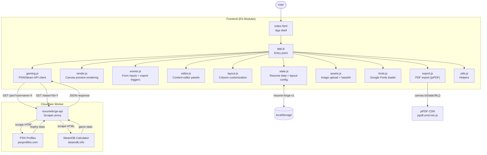

<div align="center">

# Resume Forge

Build gaming-inspired resumes with live stats

[![Live][badge-site]][url-site]
[![HTML5][badge-html]][url-html]
[![CSS3][badge-css]][url-css]
[![JavaScript][badge-js]][url-js]
[![Cloudflare][badge-cloudflare]][url-cloudflare]
[![Claude Code][badge-claude]][url-claude]
[![License][badge-license]](LICENSE)

[badge-site]:       https://img.shields.io/badge/live_site-8b5cf6?style=for-the-badge&logo=googlechrome&logoColor=white
[badge-html]:       https://img.shields.io/badge/HTML5-E34F26?style=for-the-badge&logo=html5&logoColor=white
[badge-css]:        https://img.shields.io/badge/CSS3-1572B6?style=for-the-badge&logo=css3&logoColor=white
[badge-js]:         https://img.shields.io/badge/JavaScript-F7DF1E?style=for-the-badge&logo=javascript&logoColor=black
[badge-cloudflare]: https://img.shields.io/badge/Cloudflare_Workers-F38020?style=for-the-badge&logo=cloudflare&logoColor=white
[badge-claude]:     https://img.shields.io/badge/Claude_Code-CC785C?style=for-the-badge&logo=anthropic&logoColor=white
[badge-license]:    https://img.shields.io/badge/license-MIT-404040?style=for-the-badge

[url-site]:       https://resume.neorgon.com/
[url-html]:       #
[url-css]:        #
[url-js]:         #
[url-cloudflare]: https://workers.cloudflare.com/
[url-claude]:     https://claude.ai/code

</div>

---

## Overview

Resume Forge is a gaming-inspired resume builder for tech and gaming professionals. Create visually striking resumes with heart-rated skills, live PSN trophies, Steam stats, and custom layouts. Export as PDF with one click.

**Live:** resume.neorgon.com

---

## Features

- **Live Gaming Stats** — Auto-fetch PSN trophies and Steam playtime
- **Heart-Rated Skills** — 5-heart rating system for visual skill display
- **Full Layout Control** — Customize column position, width, colors, backgrounds
- **Google Fonts** — Creative typography with gaming/retro fonts
- **PDF Export** — One-click export with jsPDF
- **Asset Uploads** — Add profile photos and custom backgrounds (localStorage)
- **Zero Build** — Pure ES modules, no compile step

---

## Running locally

**Frontend:**

ES modules require an HTTP server (not `file://`):

```bash
make serve
```

Or manually:

```bash
python3 -m http.server 8822
```

**Worker (optional):**

```bash
cd worker
wrangler dev
```

The worker is already deployed at `resumeforge-api.neorgon.workers.dev` for production use.

---

## Architecture



**Directory structure:**

```
resume-forge-site/
├── index.html                 # HTML shell
├── css/
│   └── style.css              # All styles
├── js/
│   ├── app.js                 # Entry point (<50 lines)
│   ├── state.js               # Shared state + localStorage
│   ├── render.js              # Canvas rendering
│   ├── events.js              # Event handlers
│   ├── editor.js              # Editor panels (experience, skills, etc.)
│   ├── layout.js              # Column customization
│   ├── gaming.js              # PSN/Steam integration
│   ├── assets.js              # Image upload, base64
│   ├── fonts.js               # Google Fonts loader
│   ├── export.js              # PDF export (jsPDF)
│   ├── data.js                # Default templates
│   └── utils.js               # Helpers
├── worker/
│   ├── wrangler.toml          # Cloudflare Worker config
│   └── src/
│       └── index.js           # PSN/Steam scraper proxy
├── docs/
│   ├── architecture.mmd       # Mermaid source
│   └── architecture.svg       # Generated diagram
├── favicon.ico
├── energon-classic-logo.png
├── robots.txt
├── sitemap.xml
├── CNAME
├── Makefile
└── README.md
```

---

<div align="center">
<sub>Part of <a href="https://neorgon.com/">Neorgon</a></sub>
</div>
