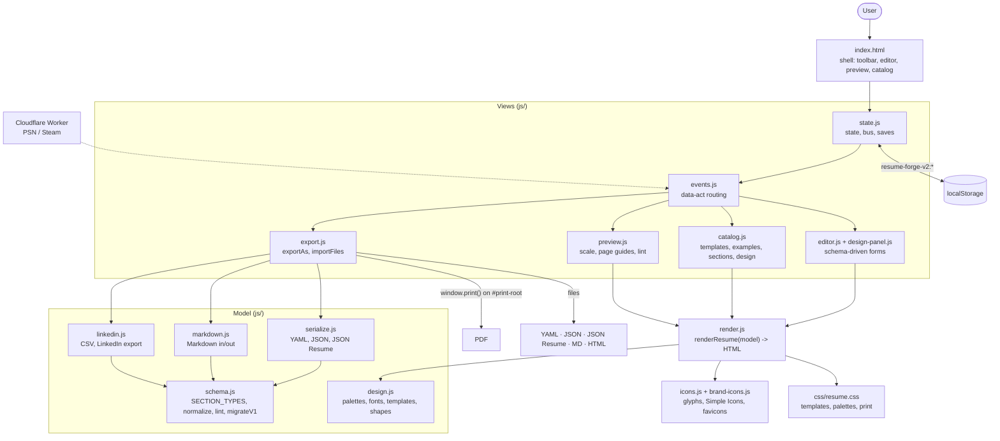

<div align="center">

# Resume Forge

CV builder: YAML in, PDF out

[![Live][badge-site]][url-site]
[![HTML5][badge-html]][url-html]
[![CSS3][badge-css]][url-css]
[![JavaScript][badge-js]][url-js]
[![Cloudflare][badge-cloudflare]][url-cloudflare]
[![Claude Code][badge-claude]][url-claude]
[![License][badge-license]](LICENSE)

[badge-site]:       https://img.shields.io/badge/live_site-8b5cf6?style=for-the-badge&logo=googlechrome&logoColor=white
[badge-html]:       https://img.shields.io/badge/HTML5-E34F26?style=for-the-badge&logo=html5&logoColor=white
[badge-css]:        https://img.shields.io/badge/CSS3-1572B6?style=for-the-badge&logo=css3&logoColor=white
[badge-js]:         https://img.shields.io/badge/JavaScript-F7DF1E?style=for-the-badge&logo=javascript&logoColor=black
[badge-cloudflare]: https://img.shields.io/badge/Cloudflare_Workers-F38020?style=for-the-badge&logo=cloudflare&logoColor=white
[badge-claude]:     https://img.shields.io/badge/Claude_Code-CC785C?style=for-the-badge&logo=anthropic&logoColor=white
[badge-license]:    https://img.shields.io/badge/license-MIT-404040?style=for-the-badge

[url-site]:       https://resume.neorgon.com/
[url-html]:       #
[url-css]:        #
[url-js]:         #
[url-cloudflare]: https://workers.cloudflare.com/
[url-claude]:     https://claude.ai/code

</div>

---

## Overview

Resume Forge treats a CV as **data**: one YAML document (or JSON, JSON Resume, Markdown, or
your LinkedIn export) rendered through templates you can switch at any time. Six layouts,
thirteen palettes, ten font pairings, banner and photo shapes, icon tiles for socials and
hobbies, and a vector PDF with selectable text and working links. Everything runs in the
browser; saves live in the browser's storage.

**Live:** resume.neorgon.com

---

## Features

- **Templates**: banner (the reference layout: band with a pattern or photo, circle portrait over the edge, pill headings), sidebar, split, classic (single column, parser-friendly), stripe, cards. Switching keeps every word.
- **Sections as data**: experience, education, skills (tags, bars, dots, hearts, list, grid), languages, certifications, projects, awards, volunteering, publications, icon rows (socials, trophies, hobbies, tools), lists with a picture, tags, contact, references, gaming stats. Reorder, move between the main and side column, hide, delete.
- **Icons three ways**: 101 brand marks from Simple Icons vendored and recoloured by the palette, 56 drawn glyphs, the link's favicon, or an uploaded file (SVG or PNG, e.g. from freeicons.io) kept as a data URI.
- **Design**: palette, colour overrides, font pairing or any two Google Fonts, density, paper size, heading style, entry style (plain, timeline, cards), bullet glyph, photo shape and ring, banner shape, height, pattern and background image, column side and width.
- **Catalog**: templates rendered with your own data, six complete example resumes, every section type with a live sample, the design controls.
- **Formats**: import and export YAML (canonical, see `template.yaml`), JSON, JSON Resume, Markdown (readable, llms.txt style, round-trips), standalone HTML; import LinkedIn's data-export ZIP or CSVs; export PDF through the print dialog.
- **Local saves**: named resumes in this browser, working copy autosaved, v1 data migrated.
- **Zero build**: plain ES modules, no compile step. `npm install` only for the node tests.

---

## Formats

| Format | In | Out | Notes |
|---|---|---|---|
| YAML | yes | yes | The canonical file. Root key `resume:`; every key is annotated in [`template.yaml`](template.yaml). |
| JSON | yes | yes | The same tree. |
| JSON Resume | yes | yes | jsonresume.org schema. Dates convert to `YYYY-MM`; a team rides as `Company (Team)` in `work[].name`. A JSON Resume pasted into the JSON importer is recognised by shape. |
| Markdown | yes | yes | `# Name`, `**Title**`, a contact line, `## Section <!-- type zone -->`, `### Entry` with a `Company (Team) · Location · Sep 2025 - Present · https://url` line and `- bullets`. Markers are optional: a hand-written file is classified by heading words. |
| LinkedIn export | yes | no | Settings > Data privacy > Get a copy of your data. Drop the ZIP, or pick the CSVs. Profile, Positions, Education, Skills, Languages, Certifications, Projects, Honors, Email Addresses, PhoneNumbers, Volunteering, Publications, Courses, Organizations are mapped; headers match by name with synonyms. |
| HTML | no | yes | One self-contained page with the sheet CSS inlined. |
| PDF | no | yes | Browser print pipeline: vector text, links, pagination. Choose "Save as PDF", no margins, background graphics on. |

Validate or convert a file without the site:

```bash
npm install                          # once: js-yaml
node validate.mjs my.resume.yaml     # lint; exit 1 on warnings
node validate.mjs --print md my.resume.yaml > my.resume.md
```

---

## Running locally

```bash
make serve      # http://localhost:8822
npm test        # node tests: round-trips, JSON Resume, LinkedIn fixture, v1 migration
```

ES modules require an HTTP server, `file://` will not work.

**Worker (optional, gaming stats):** `cd worker && wrangler dev`. Deployed at `resumeforge-api.neorgon.workers.dev`.

---

## Architecture



**Directory structure:**

```
resume-forge-site/
├── index.html               # shell
├── template.yaml            # annotated schema, every key
├── validate.mjs             # CLI: lint or convert a file with the site's own parser
├── css/
│   ├── style.css            # app chrome
│   └── resume.css           # the sheet (self-contained; inlined into the HTML export)
├── js/                      # ES modules, see CLAUDE.md for the module table
├── library/                 # example resumes (real YAML) + index.json
├── assets/icons/brands/     # vendored Simple Icons SVGs (CC0) -> js/brand-icons.js
├── tools/build-icons.mjs    # regenerates js/brand-icons.js
├── tests/                   # node --test
├── worker/                  # Cloudflare Worker: PSN/Steam proxy
└── docs/architecture.mmd    # Mermaid source for the diagram above
```

Brand icons are from [Simple Icons](https://simpleicons.org/) (CC0 1.0); brand marks belong to their owners. Favicons come from Google's favicon service only when a link asks for one.

---

<div align="center">
<sub>Part of <a href="https://neorgon.com/">Neorgon</a></sub>
</div>
